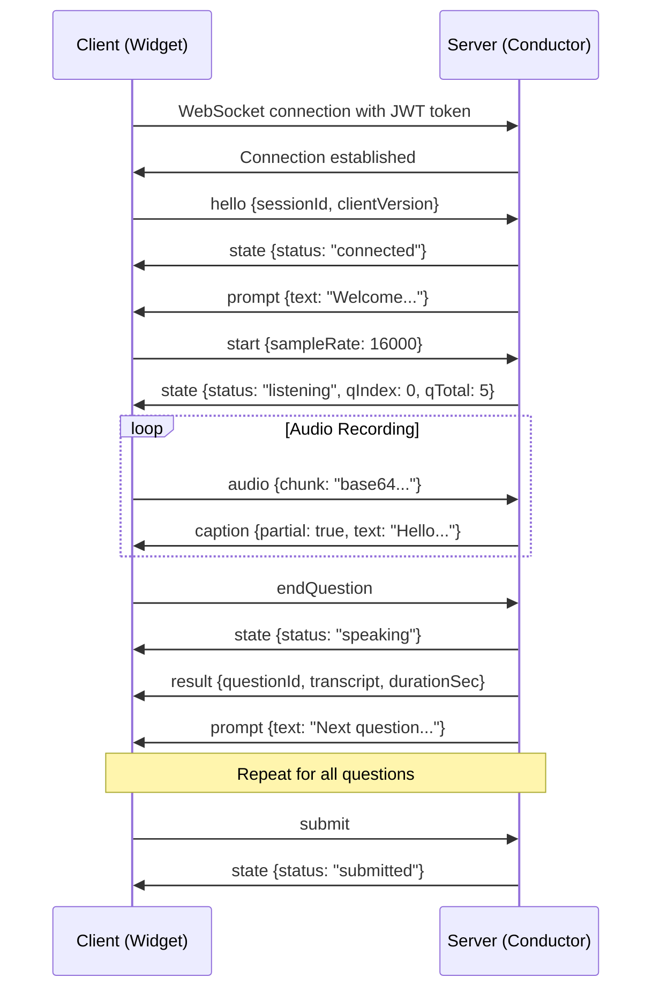

# Embed WebSocket Protocol Specification

**Version:** 1.0.0  
**Status:** Frozen  
**Last Updated:** 2025-09-01

## Overview

This document defines the WebSocket protocol for the AI Interviewer embed widget. The protocol enables real-time bidirectional communication between the embedded widget (client) and the interview conductor (server).

## Connection

- **Endpoint:** `wss://your-domain.com/ws/embed`
- **Authentication:** JWT token via query parameter `?token=<embed_token>`
- **Protocol:** WebSocket with JSON message format
- **Heartbeat:** Ping/Pong every 30 seconds

## Message Format

All messages are JSON objects with a `type` field that determines the message structure.

```typescript
interface BaseMessage {
  type: string;
  [key: string]: any;
}
```

## Client to Server Events

### 1. Hello (Connection Initialization)
```typescript
{
  type: "hello",
  sessionId: string,
  clientVersion?: string // defaults to "1.0.0"
}
```

### 2. Start Recording
```typescript
{
  type: "start",
  sampleRate?: number // defaults to 16000
}
```

### 3. Audio Data
```typescript
{
  type: "audio",
  chunk: string // base64 encoded PCM16LE 16kHz audio
}
```

### 4. End Current Question
```typescript
{
  type: "endQuestion"
}
```

### 5. Submit Interview
```typescript
{
  type: "submit"
}
```

### 6. Ping (Heartbeat)
```typescript
{
  type: "ping",
  t: number // timestamp
}
```

## Server to Client Events

### 1. State Update
```typescript
{
  type: "state",
  status: "connected" | "listening" | "speaking" | "submitted",
  qIndex?: number, // current question index (0-based)
  qTotal?: number  // total number of questions
}
```

### 2. Live Caption
```typescript
{
  type: "caption",
  partial: boolean, // true for interim, false for final
  text: string
}
```

### 3. Interview Prompt
```typescript
{
  type: "prompt",
  text: string // question or instruction text
}
```

### 4. Text-to-Speech
```typescript
{
  type: "tts",
  url?: string,           // audio file URL (for complete audio)
  streamChunk?: string    // base64 audio chunk (for streaming)
}
```

### 5. Timer Update
```typescript
{
  type: "timer",
  remainingSec: number // seconds remaining for current question
}
```

### 6. Question Result
```typescript
{
  type: "result",
  questionId: string,
  transcript: string,
  durationSec: number,
  score?: number // optional scoring (0-10)
}
```

### 7. Error
```typescript
{
  type: "error",
  code: string,    // error code for programmatic handling
  message: string  // human-readable error message
}
```

### 8. Pong (Heartbeat Response)
```typescript
{
  type: "pong",
  t: number // original timestamp from ping
}
```

## Connection Flow



## Error Codes

| Code | Description |
|------|-------------|
| `AUTH_FAILED` | Invalid or expired JWT token |
| `SESSION_NOT_FOUND` | Session ID not found or expired |
| `INVALID_MESSAGE` | Malformed message format |
| `AUDIO_ERROR` | Audio processing error |
| `RATE_LIMIT` | Too many requests |
| `SERVER_ERROR` | Internal server error |

## Audio Format

- **Encoding:** PCM16LE (16-bit little-endian)
- **Sample Rate:** 16kHz
- **Channels:** Mono
- **Transport:** Base64 encoded chunks
- **Chunk Size:** Recommended 1024 samples (64ms at 16kHz)

## Security

- JWT tokens are short-lived (5-10 minutes)
- Origin validation enforced via allowlist
- Rate limiting applied per connection
- Audio data is not persisted beyond session

## Versioning

This protocol follows semantic versioning:
- **Major:** Breaking changes to message format
- **Minor:** New optional fields or message types
- **Patch:** Bug fixes, clarifications

Current version: **1.0.0**

## Implementation Notes

1. Clients should handle connection drops gracefully with exponential backoff
2. Audio chunks should be sent continuously during recording
3. Ping/pong heartbeat prevents connection timeouts
4. All timestamps are Unix milliseconds
5. Base64 encoding should not include line breaks

## Validation

All messages are validated using Zod schemas defined in `@ai-interviewer/shared/embed-protocol`.

```typescript
import { EmbedClientEventSchema, EmbedServerEventSchema } from '@ai-interviewer/shared';

// Validate client message
const clientMessage = EmbedClientEventSchema.parse(rawMessage);

// Validate server message  
const serverMessage = EmbedServerEventSchema.parse(rawMessage);
```
